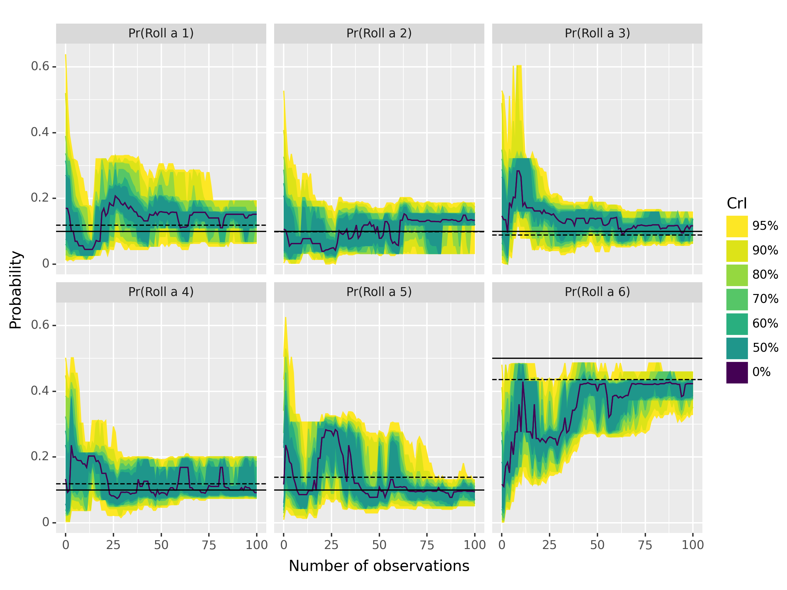

# Example of discrete observation models for pypfilt

This repository contains example scenarios for estimating the probability of rolling a 1, 2, 3, 4, 5, or 6 for a biased 6-sided die.

The simulation and observation models are defined in `src/example/__init__.py`.

## Usage

Please ensure that [nox](https://nox.thea.codes/en/stable/) is installed, and use it (a) simulate die rolls; (b) construct prior samples; (c) fit the model to the simulated die rolls; and (d) plot the results:

```sh
nox
```



## License

The code is distributed under the terms of the [BSD 3-Clause license](https://opensource.org/licenses/BSD-3-Clause) (see `LICENSE`).
